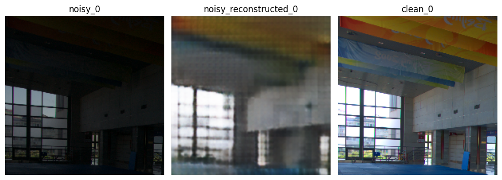
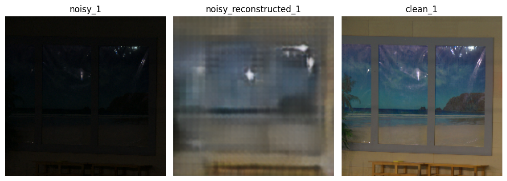
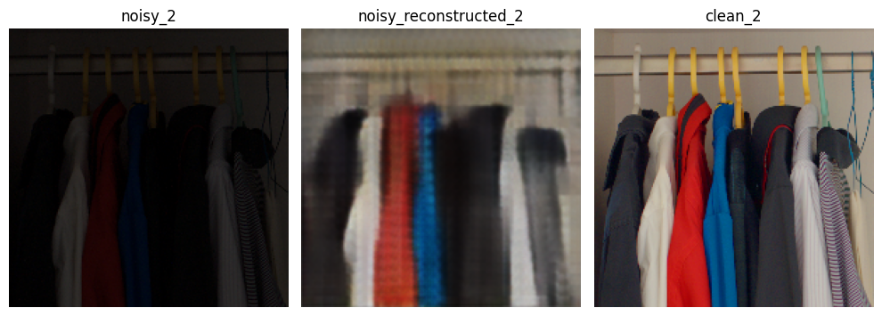
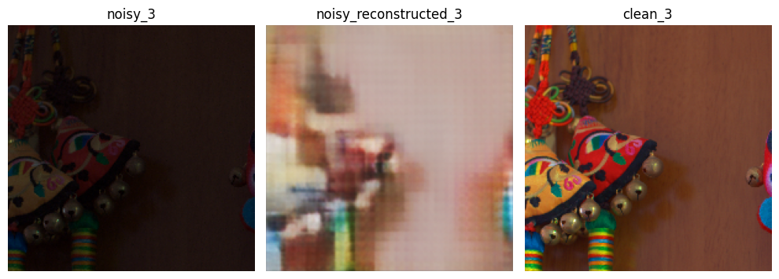
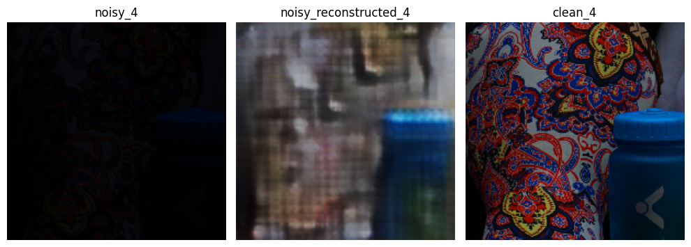
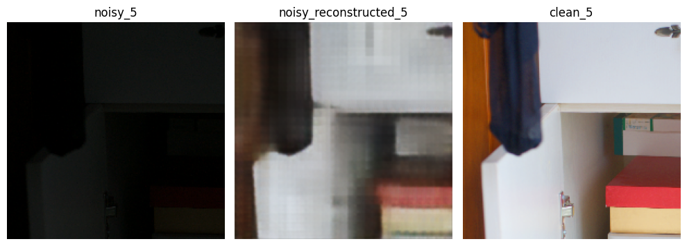

# Computational Photography

This repository contains the code for the Computational Photography Techniques that I self-learned and experimented. Models have been implemented and trained from scratch.

## Table of Contents

- [1. Dark to Bright Image Translation](#dark-to-bright-image-translation)
  - [1.1 Autoencoder](#autoencoder)
    - [1.1.a results](#results)
  - [1.2 CycleGAN](#cyclegan)
  - [1.3 Diffusion Models](#diffusion-models)
  
## 1. Dark to Bright Image Translation

The following methods have been used for dark to bright image translation:
1.1 [Autoencoder](#autoencoder)
1.2 [CycleGAN](#cyclegan)
1.3 [Diffusion Models](#diffusion-models)

### 1.1 Autoencoder

Encoder part of the model is a VGG19 backbone. MSE loss have been used for Loss criterion. Training was done for 250 epochs. 
[VGG19_CONV_DENOISER_250_epochs.pt](../Autoencoder/VGG19_CONV_DENOISER_250_epochs.pt)

#### 1.1.a results

### 1.2 CycleGAN 

Here modified version of CycleGAN specifically for Dark to Bright Image Translation has been used. The model has been trained for 200 epochs.

more infor at [SasikaA073/D2BGAN-m](https://github.com/SasikaA073/D2BGAN-m)

### 1.3 Diffusion Models

A variation of diffusion model has been used for Dark to Bright Image Translation. 
The model is under developement. 